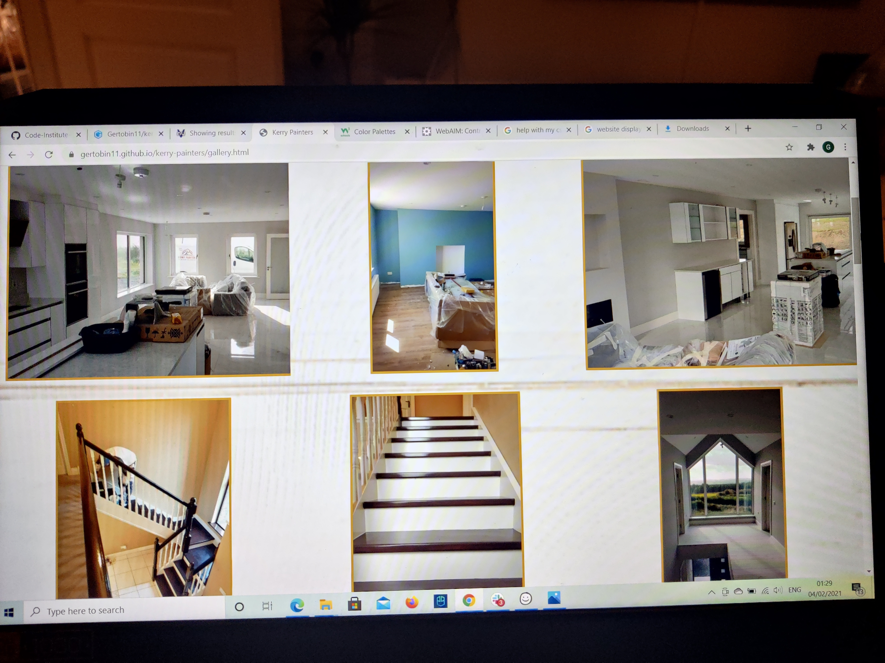

# Kerry Painters Website

## A website for Kerry Painters to provide contact information , contact forms and to showcase their work and services.

### **Table Of Contents:**

* [UX](#ux) 
    * [Project Goals](#project-goals)
    * [User Goals](#user-goals)
    * [User Stories](#user-stories)
    * [Site Owner Goals](#site-owner-goals)
    * [Design Choices](#design-choices)
        - Fonts
        - Icons
        - Colours
* [Technologies](#technologies)
* [Features](#features)
* [Futute Features](#future-features)
* [Testing](#testing)
* [Deployment](#deployment)
* [Credits](#credits)
    

    

    ### UX

    #### Project Goals

    The goal of this profect is to build a website for Kerry Painters with a few 
    key pints in mind.
    The main goal is to have a responsive website that will generate more enqiries about 
    the service that Kerry Painters provides which in turn will translate into more work and oppertunities for 
    the business to grow. 
    I would also like to showcase the work that they do through a gallery as
    I feel when the potential customers see the work that they will be impressed.

    

    #### User Goals 

    * Get a Quote 
        * Call To Acton form
        * Contact By email 
        * Get a quote by Phone Number
    * See Work Previously done 
        * gallery
        * images around site 
    * See what other services are available rather then my initial enquirery

    

    #### User Stories

    * As a website user, I want a wesite that is easy to navigate, informative and visually clear.

    * As a potential customer, I want to find information about the services they offer.

    * As a potential customer I want to see a visual repesentation of the work they have done/provide via images and galleries.

    * As a potential I want to be able to contact the owners easily, whether by email, phone or contact form.

    * I have attached a few screenshots of how I have addressed some of the user stories.

    * 
    
    * 
    
    

    #### Site Owner Goals

    * Increase customer base

    * Showcase our portfolio of work

    * Make it easier for customers to contct us

    * Make our brand more visible online

    

    #### Design Choices

    * #### Fonts
        The Fonts I chose for this project were "Abril Fatface" and "open-sans".
        I used "Abril Fatface" for the brand logo and also for headings whereas I used 
        "open-sans"
        for the other elements of the body i.e "paragraphs"

    * #### Icons: 
        The Icons I used for this were pretty basic. I got them from the 
        free version of Font Awesome. I adjusted the size and colour of them through css.

    * #### Colours:
        For the colours of the site I decided to go with 3 complimentary colours
        I used a blue #196076 a gold #BE962A and white #FFF.

    

    ### Wireframing
    For my wireframes I used Balsamiq. I kept it basic and made sue all the pictures I included were
     sketched to fit in with the tone of the wireframe. You can view my 
     wireframes [here](https://github.com/Gertobin11/gitpod-full-template/tree/master/assets/wireframes)

    

    ### Technologies

    * git 
    * bootstrap
    * fontawesome
    * google Fonts
    * GIMP (for editing the kerry painters logo)
    * balsamiq (for my wireframes)

    

    ### Languages

    * HTML
    * CSS 
    * JS & JQuery {were used by bootstrap which I used so I downloaded the cdn for them}

    ### Features
    * A call to action buttom on the hero image which brings up a modal so potential
     customers can get a quote instantly without leaving the main page.
     * A well laid out gallery to showcase the services on offer.
     * A contact us page with a form, the site owners emil addresses and contact numbers.

    ### Future Features 
    * I would love to implement a form where the potential customer was given a choice of jobs, sizes and and paint type where upon entering they could get an instant ballpark figure quote.

    ### Testing & Bugs
    * I ran my webpages through jigsaw validator and I came up with 3 errors in the website which were easil fixed, 2 were simple missed property type where I put in size instead of resize, and another was bottom-border-width: 40% , which I didnt need so I just took it out
    * I ran the web pages through W3C validator and I had one error where I put an a tag as a descendant of a button which I corrected easily enough by placing it in a form with an action value.
    * I tested the responsiveness throughout with chrome developer tools and any issues I had I fixed with adjusting my bootstrap grid and columns and in css with media queries. 
    * I wanted the website to be easy to navigate and visually clear so I tested the navigation on multiple devices and checked the contrast with WEBAIM.org it has a handy tool that lets you see the contrast ratios of the colours on your site , using this I made the blue darker as it would be easier to see the content and make it more accessable.
    * An important aspect of the site goals and user goals is connecting customers to the site owners so making sure the emails , phone numbers and contact forms were working , I found that the sub,it button wasnt acting like it should so I checked and it was placed outside the form so on correction it worked as it should.
    * The main purpose of the gallery was to showcase the work by the site owners , but when I was testing it visually the images looked very stretched , I had given the images a height and a width and they lost their aspect ratio and conformed to the specified dimentions. I just wrapped the images in  a div and set the height of the div and the height of the image inside the div to 100% and no width value and overflow : hidden and this solved it.
    * Ran ths css validator again after all my editing and it came out good.
    * Ran  the html validator and I had 3 errors . I had my icons wrapped in a h3 bracket with nothing else inside , so I deleted the h3 brackets and then I increased the font size of the icons t make it appear the same.
    * All the other pages passed.
    * I checked the responsiveness of the final version and the only problem I encountered that  I havent rectifies is in the gallery when viewing on mobile 2 pictures bleed off the right hand side of the screen.
    * I checked the pop up form by trying to submit an empty field and it worked as I hoped by briging me back to the required field.
    * I also used the above method with the contact form on the contact us page, as abve it worked as I had hoped .
    * I made sure all the navigation links were working and the enquire button was sending us to the contact page , I found no issues.
    * While I was developing I encountered a few problems with margins pushing content from where I wanted to position them , this was easily solved by targeting the objects with css.
    * I also had a few problems in development with font sizes when moving from desktop to mobile, I solved these with media queries
    
    ### Deployment

    ### Steps taken when I deployed the website on github pages

     * Kerry Painters was created in github , developed in gitpod and deployed on github pages.
     * To deploy I opened up github and logged in using my username and password.
     * On the left hand side of the page shows my repositories and I selected Gertobin11/kerry-painters.
     * Clicked on the settings Icons.
     * Scrolled down to github pages.
    * Click on the source box, it says none , so changed that to master and pressed save.
    * Kerry Painters website is live on github pages.

    #### Running it locally

    * In the browser window type "https://github.com/Gertobin11/kerry-painters" into the address bar.
    * Click on the download code button.
    * In the dropdown menu you can clone the repository or clck on the download link
    * Open up your favourite IDE and clone the repository orupload the files that you downloaded.
    * Or if our a gitpod user simply press the green gitpod button to open it up in your gitpod workspace.
    * Or simply paste this link                     

    
    
    ### Credits

    * Firstly to code institute which showed me how to start using code, also on the course I took my inspiration for my pp up modal from the whiskey drop module we covered.
    * I found writing the readme file pretty tough but I found a great readme by a code institute student on slack and I have her to thank for my inspiration and layout. Her github s here if you want to check it out , I strongly advise you do as its amazing https://github.com/byIlsa/Aloy-from-outcast-to-heroine/blob/master/README.md
    * Thanks to everybody on slack , everyone was helpful in mny ways from motivation to project insights.
    * Stackoverflow and W3schools were really handy when I couldnt get something to react a certain way , they provided a fresh insight in how to manipulate code, or just target the proprty I wanted to.
    * Bootstrap was instrumental in my project as I based all my responsiveness off its grid system , I also took forms, classes and the modal from its website.
    * Images I got from unsplash.com , shutterstock and from Kerry Painters themselves.
    * I used gimp to change the Kerry Painters logo.
    * I used w3schools to see complimentary colours for the site.
    * I used google fonts for my fonts.
    * I used font awesome for my icons.
